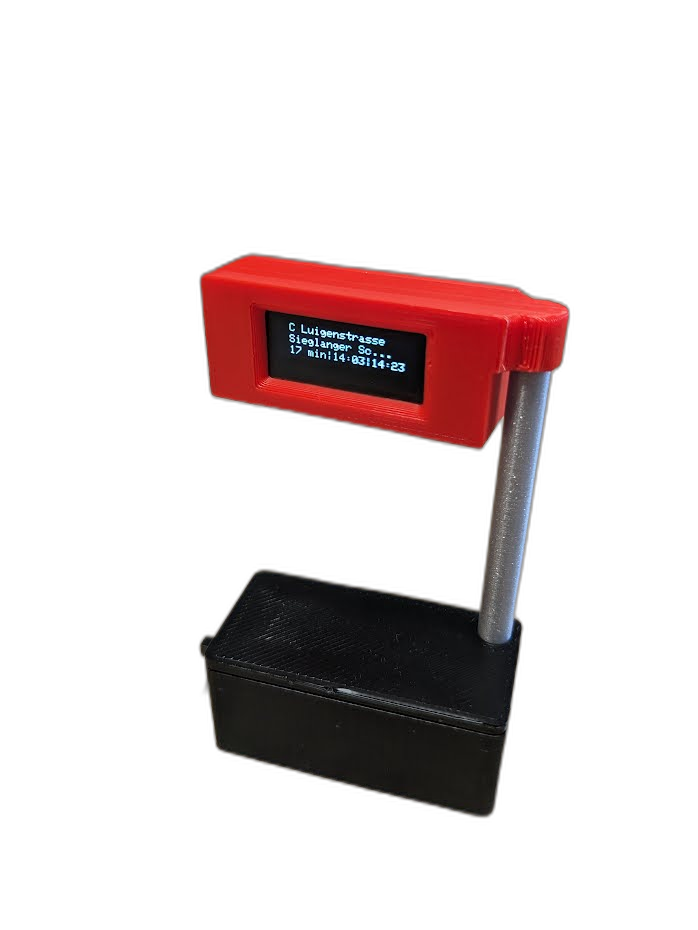
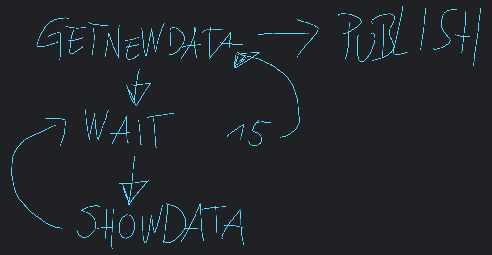

# Praxisprojekt Haltestelle 
mit Seeed Studio XIAO ESP32C3 und Node-RED

# Opendata
Echtzeitdaten via Datensatz/API von Wiener Linien:   
 https://www.data.gv.at/katalog/de/dataset/522d3045-0b37-48d0-b868-57c99726b1c4

# Node-RED

## Beispielrequest
`http://www.wienerlinien.at/ogd_realtime/monitor?stopId=147&activateTrafficInfo=stoerungkurz&acti vateTrafficInfo=stoerunglang&activateTrafficInfo=aufzugsinfo`

## Flow
Wienerlinien-API.json

# ESP32 Sketch

Mit dem Enum wird die Hauptlogik des Sketches gesteuert.

* ESP32 sendet MQTT zu Node-RED
* HTTP-Request wird getriggert 
* Function-Node bearbeitet JSON von Wienerlinien
* Ergebnis wird via MQTT an ESP32 gesendet
* MQTT Subscription / Callback am ESP32 
* Daten werden aufbereitet und am OLED Display angezeigt
* nach xx Sekunden wird Ablauf neu gestartet

# 3D-Files
comming soon

Wurde mit SovleSpace erstellt

Viel Spaß beim Nachbauen   
**https://links.pixelEDI.eu**
