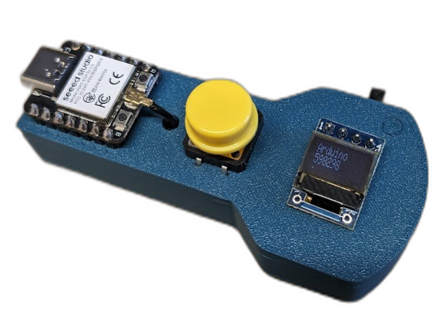
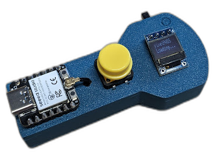

# Time-based one-time password
mit Seeed Studio XIAO ESP32C3

Verwende einene ESP32 zum generieren deiner 2FA Codes.

# Projekt-Logik

1) Secret von Website für 2FA wird im Code hinterlegt
2) ESP32 holt sich den aktuellen UnixTimestamp per NTP-Server
3) Bluetooth Verbindung zum PC wird hergestellt
4) TOTP kann am ESP32 berechnet werden
5) kurzer Button klick switch durch die hinterlegten Websites
6) langer klick (>600ms) Code wird per Bluetooth zum PC übertragen.

# Hardware
* ESP32C3 XIAO
* Button + 10k Widerstand
* OLED 0,42"

# Python - zum Testen/Kontrollieren 
`#pip install pyotp`   
Mit der *totp.py* Datei kann der generierte ESP32-TOTP Code kontrolliert werden.

# ESP Sketch
* 01_totp: erzeugt nur den Code und gibt ihn am Serial Monitor aus
* 02_mitble: Übertragt den Code auch per Bluetooth
* 03_gesamtesBeispiel

## Verwendete Bibliotheken
* TOTP: https://github.com/fatlab101/arduino_totp/
* BLE Library: https://github.com/T-vK/ESP32-BLE-Keyboard

# 3D-Files

folgt...   
Wurde mit SovleSpace erstellt

Viel Spaß beim Nachbauen   
**https://links.pixelEDI.eu**
