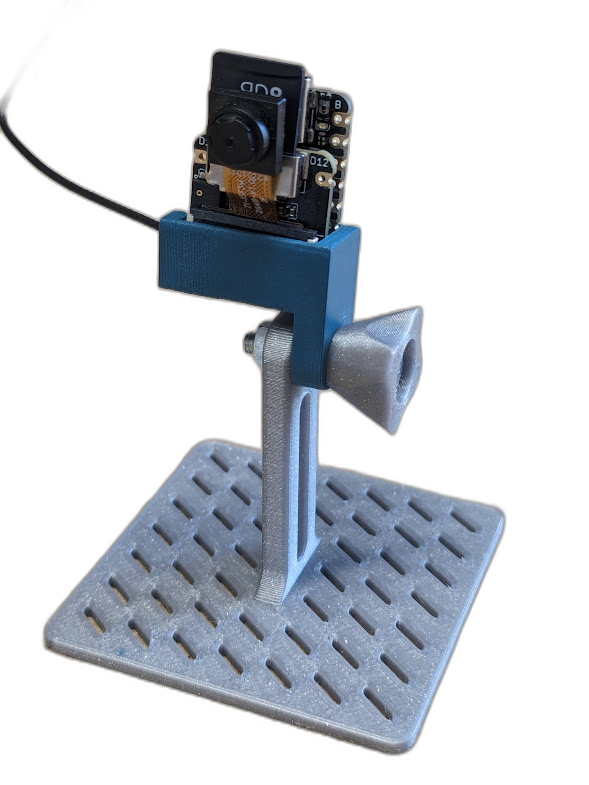

# Livestream zu Node-RED mit ESP32 Sense

* Python Script zum Testen von Websocket-Server
* Mehrere ESP32 Sketche mit Tests für Websocket Verbindung
* Letztes Beispiel zeigt die Übertragung des Livebildes per Websocket zu Node-RED
* Node-RED Flow zum Import und Beispiel -> Siehe Links für zusätzliches Modul für Image

# Links
## 3D Stand
https://www.printables.com/de/model/775813-seeedstudio-xiao-sense-stand-esp32-s3

## ESP32C3 vs ESP32S3
https://www.seeedstudio.com/xiao-series-page

## ESP32S3 Sense
https://wiki.seeedstudio.com/xiao_esp32s3_getting_started/

## Video Streaming
https://wiki.seeedstudio.com/xiao_esp32s3_camera_usage/#project-ii-video-streaming

## Node-RED Modul Bildanzeige
Link: https://flows.nodered.org/node/node-red-contrib-image-output    
Name: node-red-contrib-image-output
