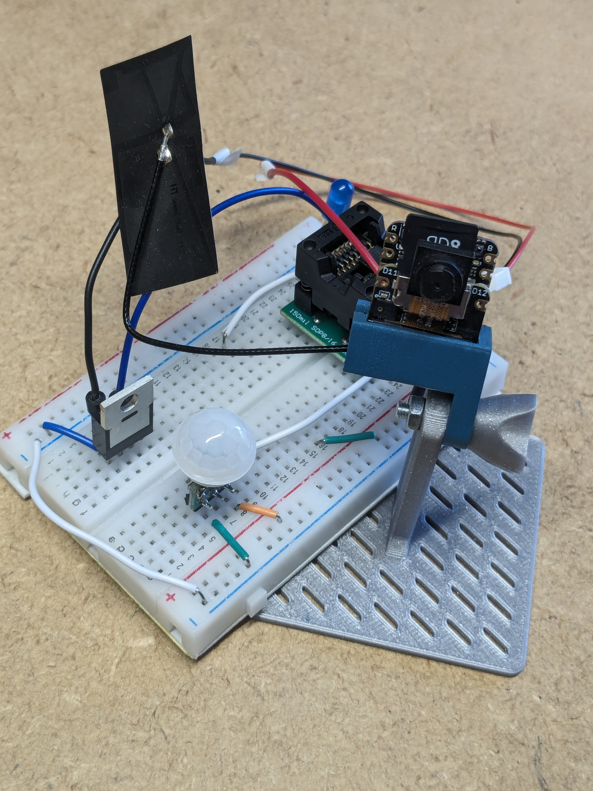
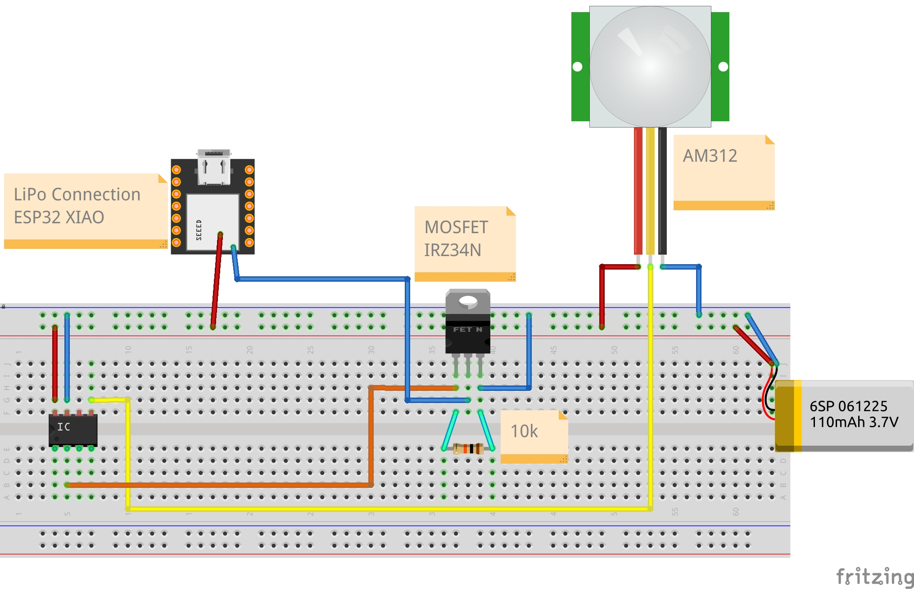

# Ein MCU schaltet mit MOSFET zweiten MCU ein/aus

## Verdrahtung

## Code
* 1x CH32v003 Code - Auch ATmega oder ATtiny möglich
* 1x ESP32 Sense Cam
* Node-RED Flow

## Bauteile
* ESP32 Sense
* CH32v003
* AM312 Bewegungssensor
* IRLZ34N MOSFET

## Links
* https://datasheetspdf.com/pdf-file/547496/InternationalRectifier/IRLZ34N/1
* https://forum.seeedstudio.com/t/esp32s3-sense-camera-very-high-deep-sleep-current-any-solution/274705/5
