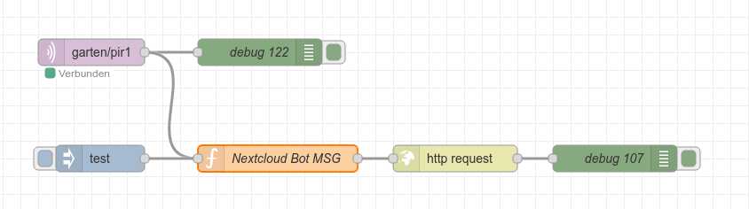

# Nextcloud Bot Nachrichten via ESP32 und Node-RED




## Bots verwalten
Talk API:
https://nextcloud-talk.readthedocs.io/en/latest/bots/#sending-a-chat-message   
Alle OCCs Commands:
https://nextcloud-talk.readthedocs.io/en/latest/occ/#talkbotinstall

### Bot installieren
Random Key
`openssl rand -hex 40`

`sudo docker exec --user www-data -it nextcloud-aio-nextcloud php occ talk:bot:install --feature response nxtcldBot 5b9f74cff09080be20da33aa6bb546f7bed5841a434jl34kjlk34j5l34kj5 https://doesntMatterBecauseItisNotusedOnlyResponse`

#### list
`sudo docker exec --user www-data -it nextcloud-aio-nextcloud php occ talk:bot:list`

#### uninstall
`sudo docker exec --user www-data -it nextcloud-aio-nextcloud php occ talk:bot:uninstall 1`


# Node-RED Funktion

```javascript

function signMessage(sharedSecret, message, randomHeader) {

    var randomHeaderBytes = cryptojs.enc.Utf8.parse(randomHeader);
    var sharedSecretBytes = cryptojs.enc.Utf8.parse(sharedSecret);
    var messageBytes = cryptojs.enc.Utf8.parse(message);
    // Erstelle eine HMAC-Instanz mit SHA256 und dem gemeinsamen Geheimnis
    var hmac = cryptojs.algo.HMAC.create(cryptojs.algo.SHA256, sharedSecretBytes);
    // Aktualisiere die HMAC mit dem zufälligen Header und der Nachricht
    hmac.update(randomHeaderBytes);
    hmac.update(messageBytes);   
    // Berechne den endgültigen Hash und konvertiere ihn in einen Hexadezimal-String
    var hash = hmac.finalize().toString(cryptojs.enc.Hex);

    return hash;
}

const randomValue = Array(32).fill().map(() => Math.random().toString(36)[2]).join('');
const secret = '81bc2c48fa3b0f828624623dac9d70d1d69876e4ed78ede67752e3521d89875b1905651bbdba0f2f';

const messageData = {
    'message': msg.payload,
    'silent': false
};


const message = messageData.message;
const digest = signMessage(secret, message, randomValue);

var headers = {
    'Content-Type': 'application/json',
    'X-Nextcloud-Talk-Bot-Random': randomValue,
    'X-Nextcloud-Talk-Bot-Signature': digest,
    'OCS-APIRequest': 'true',
};

var msg = {
    headers: headers,
    payload: messageData
};


return msg;
```


