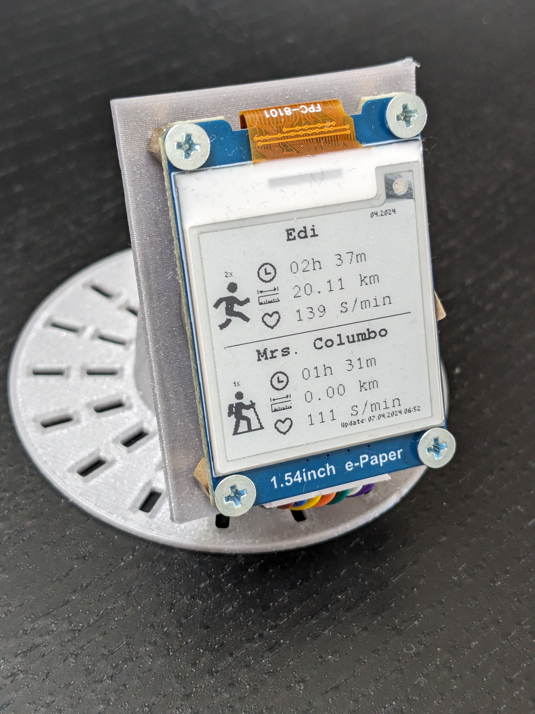
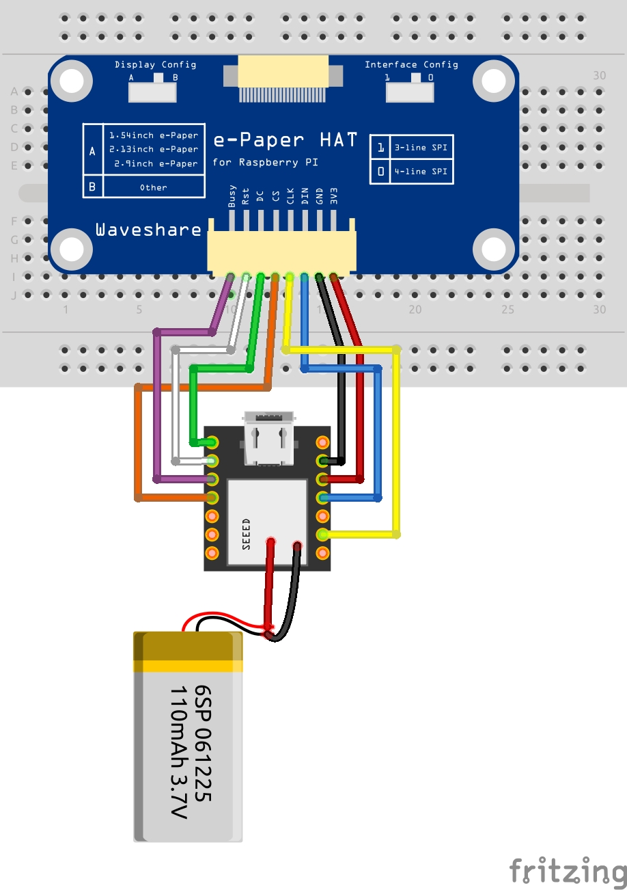

# e-Paper mit ESP32
 
Willkommen zum GitHub-Repository für mein Projekt zur Integration der Polar API mit Node-RED! 
In diesem Projekt habe ich einen OAuth-Flow implementiert, um auf die Polar API zuzugreifen. Z
usätzlich habe ich ein 1,54-Zoll-ePaper-Display verwendet, auf dem eigene Grafiken und statischer Text dargestellt werden.

* 3x ESP32 Code für E-Ink Ansteuerung
* 1x Node-RED Flow für OAUTH

#### Verdrahtung

#### ESP32 XIAO
* Pinout: https://wiki.seeedstudio.com/XIAO_ESP32C3_Getting_Started/
* Deepsleep: https://docs.espressif.com/projects/esp-idf/en/latest/esp32/api-reference/system/sleep_modes.html

#### e-Paper
* 1.54: https://www.waveshare.com/wiki/1.54inch_e-Paper_Module_Manual#ESP32
* Demo: https://www.waveshare.com/wiki/E-Paper_ESP32_Driver_Board#Demo_Usage

## Grafiken
* https://www.photopea.com/
* https://uxwing.com/
* https://javl.github.io/image2cpp/

# Polar API

* Polar API: https://www.polar.com/accesslink-api/#introduction
* Credentials anlegen: https://admin.polaraccesslink.com/
* oauth2 URL: https://flow.polar.com/oauth2/aut

# 3D Design
https://www.printables.com/de/model/835238-stand-for-154-e-paper

Viel Spaß beim Coden
