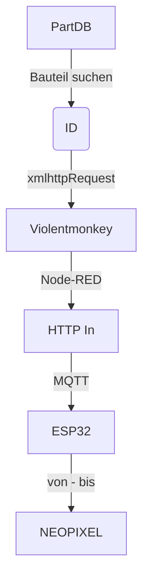

## Violentmonkey
https://violentmonkey.github.io/

## Add-On
https://addons.mozilla.org/de/firefox/addon/violentmonkey/

## Datenflow

## Requests
// @grant        GM_xmlhttpRequest
https://violentmonkey.github.io/api/gm/#gm_xmlhttprequest

beim ersten Aufruf muss Aufruf von externer Quelle bestätigt werden

F5 drücken, beim ersten start wird skript nicht gestartet
