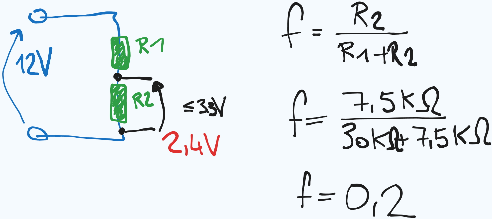

# Voltage Sensor

Dieses Projekt verwendet einen Spannungsteiler, um eine Spannung zu messen und den Wert über die serielle Schnittstelle auszugeben.
- Spannungssensor: https://amzn.to/41HYtoA (Affiliate)


## Prinzip des Spannungsteilers
Ein Spannungsteiler besteht aus zwei Widerständen (R1 und R2), die in Serie geschaltet sind. Der Messwert wird durch das Verhältnis dieser Widerstände bestimmt. Im aktuellen Setup ist R1 = 30kΩ und R2 = 7.5kΩ. Der Spannungsteiler reduziert die Eingangsspannung, die dann mit einem Mikrocontroller gemessen wird.


Die Formel für den Spannungsteiler ist:



```
V_out = V_in * (R2 / (R1 + R2))

R1 = 30kΩ
R2 = 7.5kΩ

V_out = V_in * (7.5kΩ / (30kΩ + 7.5kΩ))
V_out = V_in * (7.5 / 37.5) = V_in * 0.2
```

Ergebnis:
Der Spannungsteiler mit R1 = 30kΩ und R2 = 7.5kΩ gibt dir bereits den gewünschten Faktor von 0.2. 
Das bedeutet, dass Vout immer 20% von Vin ist.

## Funktionsweise
Der Code liest die analoge Spannung vom Pin A2, berechnet den Mittelwert aus mehreren Messungen und gibt den resultierenden Spannungswert über die serielle Schnittstelle aus.
