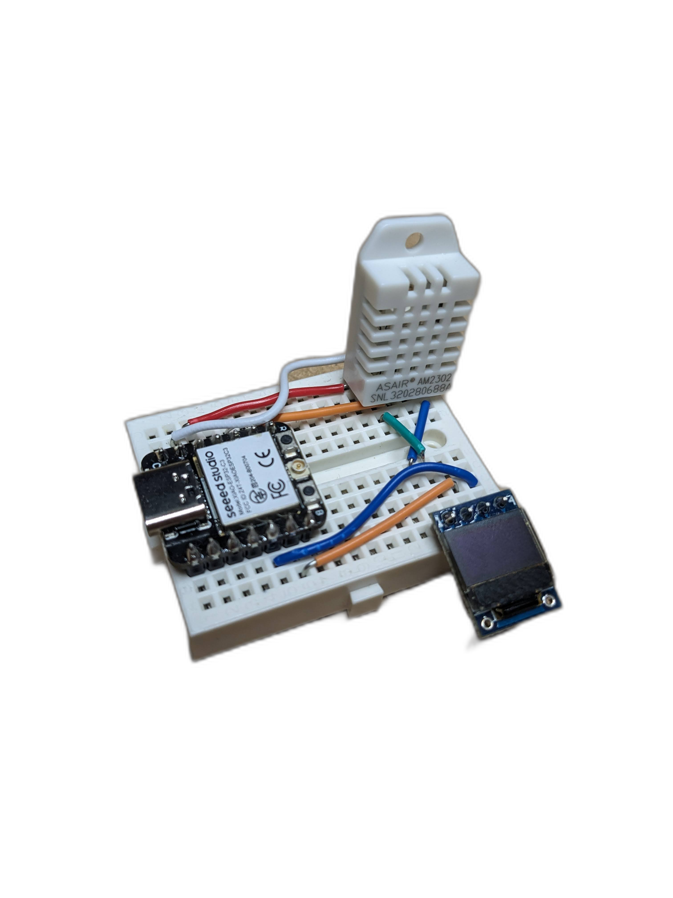

# Seeed Studio XIAO ESP32C3


## Alle Infos zum Seeed Studio XIAO ESP32C3:
https://wiki.seeedstudio.com/XIAO_ESP32C3_Getting_Started/

## Arduino IDE
Boardverwalter URL: https://raw.githubusercontent.com/espressif/arduino-esp32/gh-pages/package_esp32_index.json

Mehr Infos zur Installation: https://wiki.seeedstudio.com/XIAO_ESP32C3_Getting_Started/#software-setup


## PlatformIO
platformio.ini Beispiel

```
[env:seeed_xiao_esp32c3]
platform = espressif32
board = seeed_xiao_esp32c3
framework = arduino
monitor_speed = 115200
upload_port = /dev/ttyACM0
monitor_port = /dev/ttyACM0
lib_deps =
      adafruit/Adafruit SSD1306 @ ^2.5.9 
```

Have fun | https://links.pixelEDI.eu
